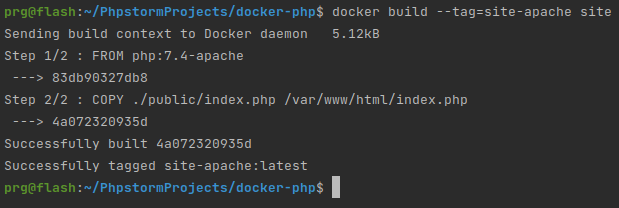
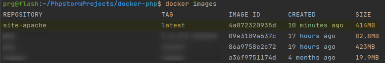
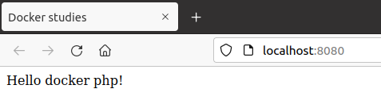

# Как мы запускаем докер контейнер
В данном случае мы рассмотрим самый простой вариант. Нам нужно запустить файл php из докер контейнера. Но докер контейнер у нас сразу включает сервер апач. По этому мы и выбрали наш стартовый образ так:
```Dockerfile
FROM php:7.4-apache

COPY ./public/index.php /var/www/html/index.php
```
Кроме этого нам нужно произвести сбоку (билд | build)
```shell
docker build --tag=site-apache site
```


Проверим что у нас появился нужный контейнер:
```shell
docker images
```


Теперь можем его запустить:
```shell
docer run -d --name app -p 8080:80 site-apache
```
